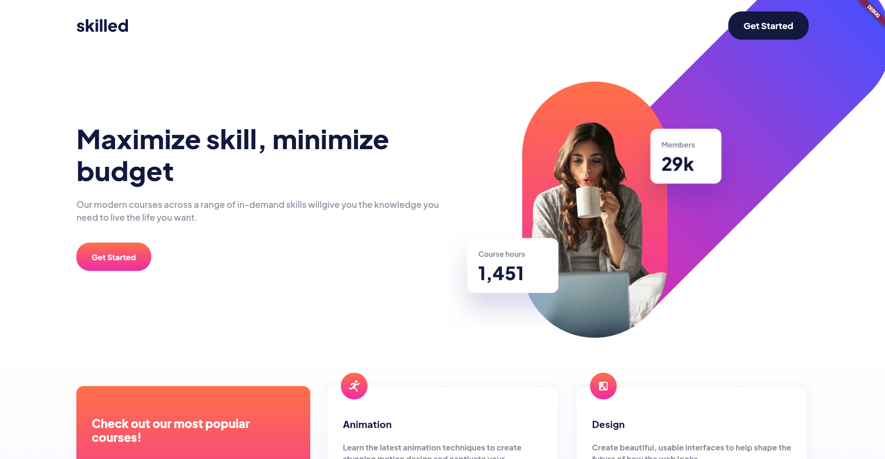

# Frontend Mentor - Skilled e-learning landing page solution

This is a solution to the [Skilled e-learning landing page challenge on Frontend Mentor](https://www.frontendmentor.io/challenges/skilled-elearning-landing-page-S1ObDrZ8q). Frontend Mentor challenges help you improve your coding skills by building realistic projects.

## Table of contents

- [Overview](#overview)
  - [The challenge](#the-challenge)
  - [Screenshot](#screenshot)
  - [Links](#links)
- [My process](#my-process)
  - [Built with](#built-with)
  - [What I learned](#what-i-learned)
  - [Continued development](#continued-development)
- [Author](#author)

**Note: Delete this note and update the table of contents based on what sections you keep.**

## Overview

### The challenge

Users should be able to:

- View the optimal layout depending on their device's screen size
- See hover states for interactive elements

### Screenshot



### Links

- Solution URL: [Add solution URL here](https://your-solution-url.com)
- Live Site URL: [Add live site URL here](https://your-live-site-url.com)

## My process

### Built with

- [Flutter](https://flutter.dev/)
- [Dart](https://dart.dev/)
- Stateless widgets:
  - Column
  - Row
  - Container
  - GridView
  - Padding
  - Stack
  - Expanded
  - ...

### What I learned

I learned to create responsive layout for mobile, table and desktop using GridView and basic widgets.

```dart
Stack(
  children: [
    SizedBox(
      height: 350,
      child: Column(
        children: [
          SizedBox(height: 28),
          Expanded(
            child: Container(
              // ...
            ),
          ),
        ],
      ),
    ),
    Positioned(
      left: 32,
      child: SvgPicture.asset('assets/$iconName', width: 56, height: 56),
    ),
  ],
)
```

### Continued development

Next time I will create different layouts in separated files and reusing components instead of a big widget with many ifs..

## Author

- LinkedIn - [Oussama Jabbari](https://www.linkedin.com/in/oussamajabbari/)
- Frontend Mentor - [@oussamajabbari](https://www.frontendmentor.io/profile/oussamajabbari)
